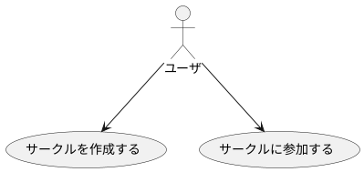
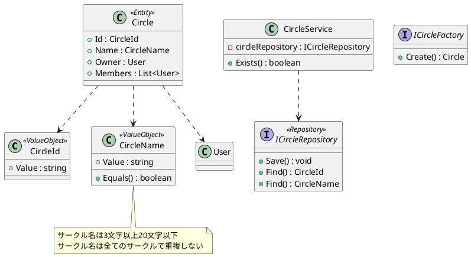
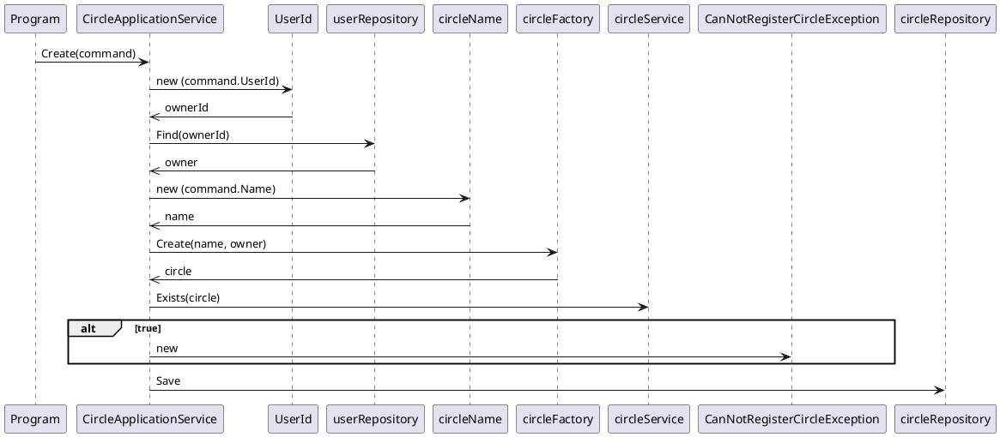
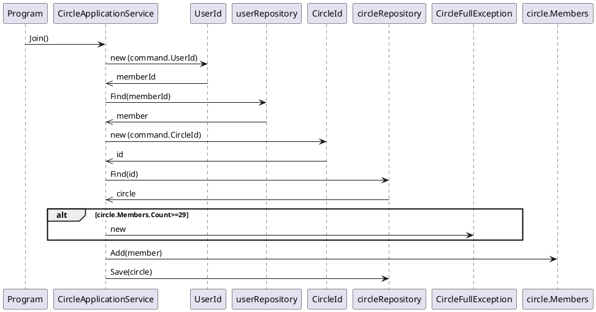
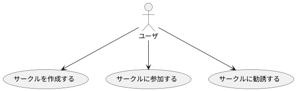
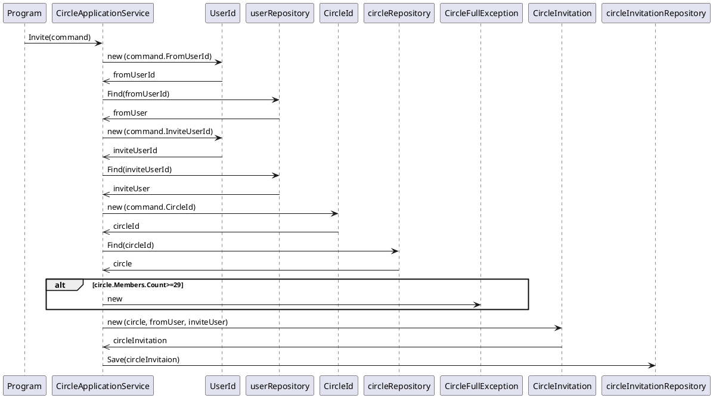

# Chapter 11 アプリケーションを1から組み立てる

## 11.1 アプリケーションを組み立てるフロー

1. 求められる機能を確認する
2. ユースケースを洗い出す
3. 必要となる概念、存在するルールからアプリケーションに必要な知識を選び出す
4. ドメインオブジェクトを準備する
5. ドメインオブジェクトを用いてユースケースを実現するアプリケーションサービスを実装する

## 11.2 題材とする機能

SNSのサークル機能を実現する

### 11.2.1 サークル機能の分析

サークルの前提条件

* サークル名は3文字以上20文字以下
* サークル名は全てのサークルで重複しない
* サークルに所属するユーザの最大数はサークルのオーナーとなるユーザを含めて30名まで

## 11.3 サークルの知識やルールをオブジェクトとして準備する

ドメインオブジェクトを準備する

## 11.4 ユースケースを組み立てる

* サークルを作成する処理

* ユーザがサークルに参加する処理

### 11.4.1 言葉の齟齬が引き起こす事態

サークルのルール
> サークルに所属するユーザの最大数はサークルのオーナーとなるユーザを含めて30名まで

一方、コードでは
> if(cirlceMembers.Count) >= 29

コードではサークルのオーナーとメンバーが別管理されているため、表現が29となっており、ルール上の表現(30)と齟齬が生まれている！

=> 本来であればルール上の表現に即した30という数字をコード上でも用いるようにすべき

### 11.4.2 漏れ出したルールがもたらすもの

サークルのルール
> サークルに所属するユーザの最大数はサークルのオーナーとなるユーザを含めて30名まで

はドメインのルール、これをアプリケーションサービスに記述していまうと、同じルールが複数箇所で重複して記述されてしまう。

サークルに勧誘するユースケースを追加

* メンバー勧誘を行う処理

**if(circle.Members.Count >= 29)** というルールがInviteメソッドにも記述されている！
メンバーの上限数を変更することになると、CircleオブジェクトのMembersプロパティがどのように使われているかをすべて検索し、そればメンバーの上限数に関する処理であったら修正するという作業を漏れなく行う必要がある。

**ルールがプロダクトのあちこちに点在してしまうと、ルールの変更に対する修正箇所も散らばることになり、修正作業の難易度は上昇していく。**

原因は、ルールに関わるコードがサービスに記述されてしまっていること
の問題を次章で集約を使って解決する。

## 11.5 まとめ

* トップダウンで機能を洗い出し、実装はボトムアップにドメインの知識を表現するドメインオブジェクトを定義し、ユースケースの実装に臨む

* 学んだことを実際に利用して、理論を実践に昇華させよう。テーマとなる機能を決めて、ユースケースや必要となる知識を考え、コードで実現するという練習を繰り返そう。

* ロジックの点在という問題を解決するために、「集約」を利用する。
