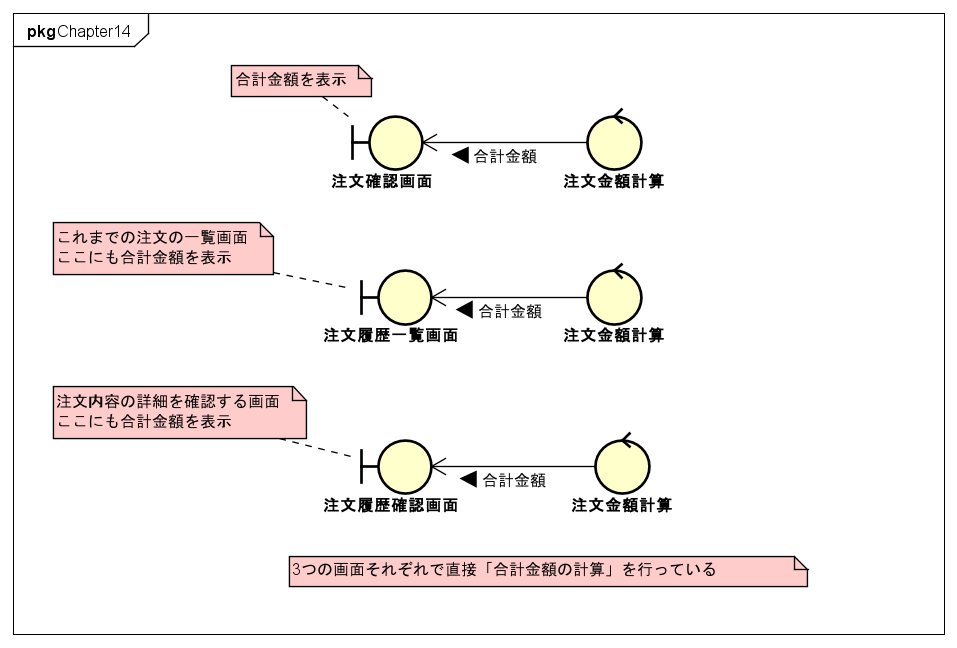

# Chapter14 アーキテクチャ

* ドメイン駆動設計はモデルとコードを結びつけるプラクティスのため、特定のアーキテクチャを前提にするものではない。
* しかし、継続的な改良に耐えうる構造である必要がある。
* アーキテクチャは、ドメイン知識を記述するための方針を示し、ルールの流出を防ぐためのものである。

## 14.1 アーキテクチャの役目

**アーキテクチャは決して主役ではない**

### 14.1.1 アンチパターン: 利口なUI

> 本来であればドメインオブジェクトに記載されるべき重要なルールやふるまいが、ユーザインターフェースに記述されてしまっている状態

* ECサイトの例

**問題点**

* 合計金額の計算はひとつでありながら、その変更が3カ所に渡る
* 当初は同じであった合計金額の計算がそれぞれの画面特有の事情により独自に成長すると、それに合わせて慎重に修正を加える必要がある

→ 後で気づいて、同じ処理は共通化される

**真の問題点**

最初の時点で画面が注文確認画面しか存在せず、後から注文履歴一覧画面と注文履歴確認画面が追加された場合、適切にリファクタリングが行われず、コードは複雑怪奇なものになっていく...。

利口なUIは捨て、ビジネスロジックを1箇所に集中させるような構成にすれば、画面固有の事情が「注文金額の計算」に入りにくく、変更時の回収も楽。

### 14.1.2 ドメイン駆動設計がアーキテクチャに求めること

アーキテクチャは、ロジックが無秩序に点在することを防ぐための方針
これによって「ドメインを捉え、うまく表現する」ことに集中する

ドメイン駆動設計がアーキテクチャに求めることは、ドメインオブジェクトが渦巻くレイヤーを隔離して、ソフトウェア特有の事情からドメインオブジェクトを防衛すること
→ アーキテクチャはどのようなものであっても構わない。

## 14.2 アーキテクチャの解説

* レイヤードアーキテクチャ
* ヘキサゴナルアーキテクチャ
* クリーンアーキテクチャ

### 14.2.1 レイヤードアーキテクチャとは

図14.5 エリック・エヴァンスが示したレイヤードアーキテクチャ

レイヤードアーキテクチャを構成する4つの層

* プレゼンテーション層 (ユーザーインターフェイス層)
* アプリケーション層
* ドメイン層
* インフラストラクチャ層

#### ドメイン層

#### アプリケーション層

#### プレゼンテーション層

#### インフラストラクチャ層

原則
依存の方向が上から下へ
上位のレイヤーは自身より下位のレイヤーに依存することが許される

### 14.2.2 ヘキサゴナルアーキテクチャとは

