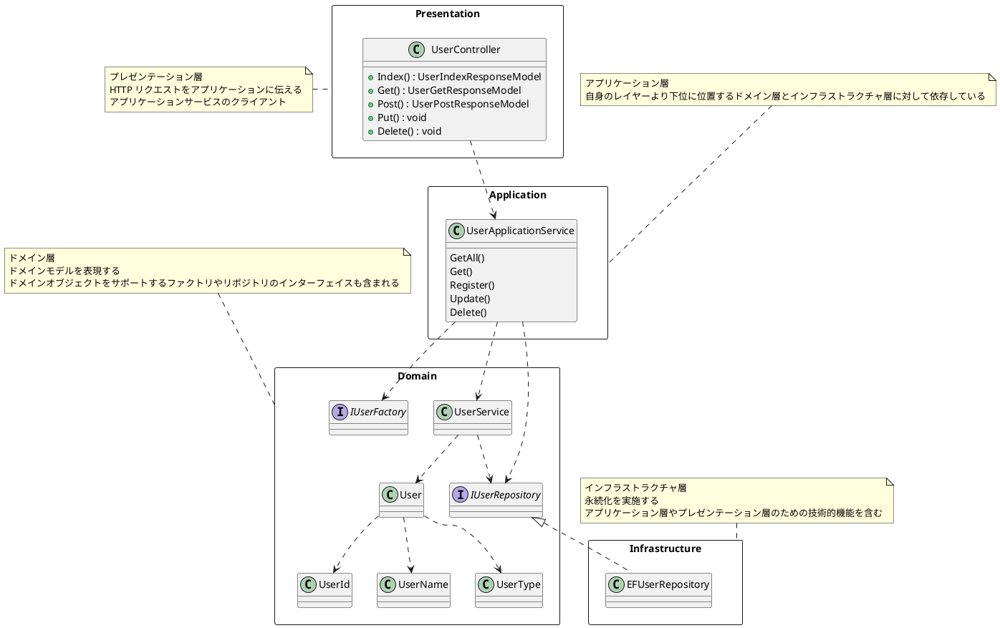
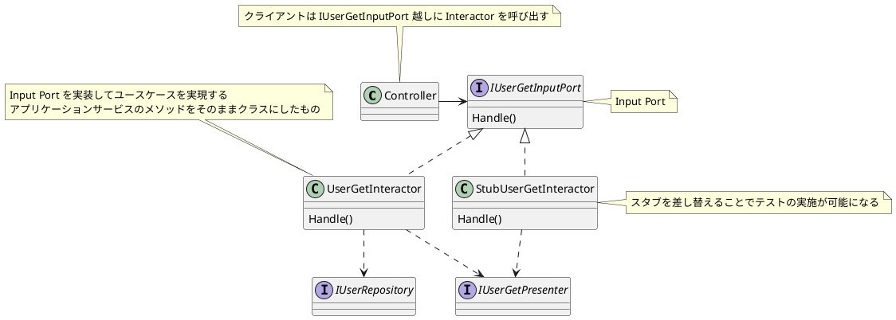

# Chapter14 アーキテクチャ

* ドメイン駆動設計はモデルとコードを結びつけるプラクティスのため、特定のアーキテクチャを前提にするものではない。
* しかし、継続的な改良に耐えうる構造である必要がある。
* アーキテクチャは、ドメイン知識を記述するための方針を示し、ルールの流出を防ぐためのものである。

## 14.1 アーキテクチャの役目

**アーキテクチャは決して主役ではない**

### 14.1.1 アンチパターン: 利口なUI

**本来であればドメインオブジェクトに記載されるべき重要なルールやふるまいが、ユーザインターフェースに記述されてしまっている状態**

* ECサイトの例


**問題点**

* 合計金額の計算はひとつでありながら、その変更が3カ所に渡る
* 当初は同じであった合計金額の計算がそれぞれの画面特有の事情により独自に成長すると、それに合わせて慎重に修正を加える必要がある

→ 後で気づいて、同じ処理は共通化される

**真の問題点**

最初の時点で画面が注文確認画面しか存在せず、後から注文履歴一覧画面と注文履歴確認画面が追加された場合、適切にリファクタリングが行われず、コードは複雑怪奇なものになっていく...。

利口なUIは捨て、ビジネスロジックを1箇所に集中させるような構成にすれば、画面固有の事情が「注文金額の計算」に入りにくく、変更時の回収も楽。

### 14.1.2 ドメイン駆動設計がアーキテクチャに求めること

アーキテクチャは、ロジックが無秩序に点在することを防ぐための方針
これによって「ドメインを捉え、うまく表現する」ことに集中する

ドメイン駆動設計がアーキテクチャに求めることは、ドメインオブジェクトが渦巻くレイヤーを隔離して、ソフトウェア特有の事情からドメインオブジェクトを防衛すること
→ アーキテクチャはどのようなものであっても構わない。

## 14.2 アーキテクチャの解説

ドメイン駆動設計と同時に語られることの多いアーキテクチャ

* レイヤードアーキテクチャ
* ヘキサゴナルアーキテクチャ
* クリーンアーキテクチャ

**ドメインが隔離されることのみが重要であり、必ずしもこのいずれかのアーキテクチャにしたがわなければいけないということではない。**

### 14.2.1 レイヤードアーキテクチャとは

図14.5 エリック・エヴァンスが示したレイヤードアーキテクチャ

レイヤードアーキテクチャを構成する4つの層

* プレゼンテーション層 (ユーザーインターフェイス層)
* アプリケーション層
* ドメイン層
* インフラストラクチャ層


![図14.5]

#### ドメイン層

* ソフトウェアを適用し用としている領域で問題解決に必要な知識を表現する。
* 明示的にドメインオブジェクトを隔離する

#### アプリケーション層

* ドメイン層の住人を取りまとめる層
* アプリケーションサービス（ドメインオブジェクトのクライアントになる）

#### プレゼンテーション層

* ユーザーインターフェイスとアプリケーションを結びつける
* 主な責務は表示と(入力の)解釈

#### インフラストラクチャ層

* 他の層を支える技術基盤へのアクセスを提供する層
* メッセージ送信や永続化など

依存の方向は上位レイヤーから下位レイヤーへ

![図14.6]

#### レイヤードアーキテクチャの実装サンプル



原則
依存の方向が上から下へ
上位のレイヤーは自身より下位のレイヤーに依存することが許される

### 14.2.2 ヘキサゴナルアーキテクチャとは

コンセプトはアプリケーションとそれ以外のインターフェイスや保存媒体をつけ外しできるようにすること

![図14.7]

ゲーム機の例

![図14.8]

アプリケーションでも同様にユーザーインターフェイスや保存媒体を変更可能にする

**ポートアンドアダプタ**とも呼ばれる

* アプリケーションに対する入力を受け持つポートとアダプタをそれぞれプライマリポート、プライマリアダプタという
* アプリケーションが外部に対してインタラクトするポートをセカンダリポートと表現し、実装するオブジェクトをセカンダリアダプタと呼ぶ

``` csharp

public class UserApplicationService
{
    private readonly IUserFactory userFactory; 
    private readonly IUserRepository userRepository;
    private readonly UserService userService;

// (...略...)

    public void Update(UserUpdateCommand command)
    {
        using (var transaction = new TransactionScope())
        {
            var id = new UserId(command.Id);
            var user = userRepository.Find(id);
            if (user == null)
            {
                throw new UserNotFoundException(id);
            }

            if (command.Name != null)
            {
                var name = new UserName(command.Name);
                user.ChangeName(name);

                if (userService.Exists(user))
                {
                    throw new CanNotRegisterUserException(user, "ユーザは既に存在しています。");
                }
            }

            // セカンダリポートであるIUserRepositoryの処理を呼び出す
            // 処理は実体であるセカンダリアダプタに移る
            userRepository.Save(user);
            
            transaction.Complete();
        }
    }
}

```

Update メソッドを呼び出すクライアントはプライマリアダプタ、Update メソッドはプライマリポートに当たる

アプリケーションは IUserRepository というセカンダリポートを呼び出すことで、具体的な実装（セカンダリアダプタ）からインスタンスを再構築したり、永続化を依頼したりする

レイヤードアーキテクチャとの違いは、インターフェイスを利用した依存関係の整理に言及しているところ

### 14.2.3 クリーンアーキテクチャとは

![図14.10]

* ビジネスルールをカプセル化したモジュールの中心に据える
* クリーンアーキテクチャの文脈でのエンティティは、ドメインオブジェクトに近い概念
* ユーザーインターフェイスやデータストアなどの詳細を端に追いやり、依存の方向を内側に向けることで、詳細が抽象に依存するという依存関係逆転の法則を達成する
* ヘキサゴナルアーキテクチャと目的とするところは同じ
* 両者の違いは、クリーンアーキテクチャには、コンセプトを実現する具体的な実装方針が明示されているところ

![図14.11]



クリーンアーキテクチャのコンセプトで重要なことは、**ビジネスルールをカプセル化したモジュールの中心に据え、依存の方向を絶対的に制御すること**

## 14.3 まとめ

* アーキテクチャは一度に多くのことを考えすぎないこと
* アーキテクチャは方針を示し、各所で考える範囲を狭めることで集中を促す
* ドメイン駆動設計においてアーキテクチャは主役ではない
* ドメインの隔離を促すことができれば、どのアーキテクチャを採用しても構わない
