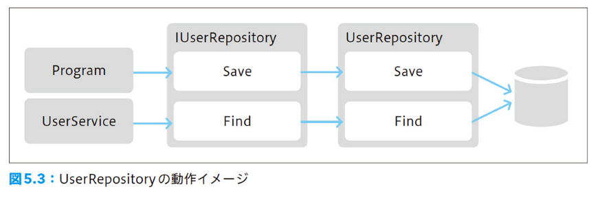

# Chapter5 リポジトリ

リポジトリは永続化や再構築を担う。

* 永続化（保存）や再構築（復元）といったデータストアを操作する処理を切り離し、抽象的に扱えるようにして処理の意図を明確にする。
* データストアの差し替えを可能にする
  * テスト実行を容易にする
  * 変更の難易度を下げる

## 5.1 リポジトリとは

* 保管庫 -> データの保管庫
* リポジトリはデータを永続化し再構築するといった処理を抽象的に行うためのオブジェクト
* データの永続化と再構築を直接行うのではなく、リポジトリを経由して行う -> ソフトウェアに柔軟性を与える

## 5.2 リポジトリの責務

* リポジトリの責務はドメインオブジェクトの永続化（保存）や再構築（復元）を行うこと
* 永続化の先はRDB、ファイル、NoSQL DBなど様々
* 永続化を実施するために記述される特定のデータストアに基づく具体的な手順はややこしい
  * [_01/Program.cs](_01/Program.cs)
  * [_01/UserService.cs](_01/UserService.cs)
  * コードの大半がデータストアに対する具体的な操作
* ユーザ作成処理をリポジトリを利用した実装に置き換えると
  * [_03/Program.cs](_03/Program.cs)
  * User オブジェクトの永続化をリポジトリである[IUserRepository](_03/IUserRepository.cs) オブジェクトに依頼する
    -> データストアに対する命令を抽象的に行うことで、ユーザ作成処理として純粋なロジックになった
* 重複チェック処理を行うドメインサービスの実装
  * [_03/UserService.cs](_03/UserService.cs)
  * コードの意図が明確になった
  
## 5.3 リポジトリのインターフェース

* リポジトリの責務はオブジェクトの永続化
  * User クラスのリポジトリインターフェースには、オブジェクトの永続化以外の処理はいれない
    * [_07/IUserRepository.cs](_07/IUserRepository.cs)

    ```csharp
    interface IUserRepository
    {
        void Save(User user);
        User Find(UserName name);
        bool Exists(User user); //重複確認の処理が入っている
    }
    ```

  * ユーザの重複確認はドメインのルールに近いので、ドメインサービスが主体となるべき
    * [_07/UserService.cs](_07/UserService.cs)

    ```csharp
    public bool Exists(User user)
    {
        // ユーザ名により重複確認を行うという知識は失われている
        return userRepository.Exists(user);
    }
    ```

  * 仮にリポジトリに重複確認を定義する場合は、ユーザ名で重複確認を行うという知識を表現するため、ユーザ名を引き渡すとよい
    * [_08/IUserRepository.cs](_08/IUserRepository.cs)

    ```csharp
    interface IUserRepository
    {
        void Save(User user);
        User Find(UserName name);
        // ユーザ名で重複確認を行うというドメイン知識を反映
        public bool Exists(UserName name);
    }
    ```

## 5.4 SQL を利用したリポジトリを作成する

* リポジトリの実装には特定の技術基盤に依存した処理を記述する
* Program クラスでIUserRepository インターフェースを扱い、その実体である UserRepository クラスの処理を呼び出す
  * [_12/Program.cs](_12/Program.cs)
* 実体である UserRepository クラス
  * [_12/UserRepository.cs](_12/UserRepository.cs)

  

  インターフェースを上手く活用することで、Programクラス上では具体的な永続化処理を記述することなくデータストアにインスタンスを永続化できるようになる

## 5.5 テストによる確認

* テストはソフトウェアの柔軟性を担保することにも寄与する
  * テストを前もって用意することで、ソフトウェアの変更にかかる検証コストを減らす
  * ドメインの変化を受けてソフトウェアが変化するためにはテストを用意することが重要

### 5.5.1 テストに必要な作業を確認する

* データベースの準備
* カラムの定義
* テーブルの作成
* データ投入
* テーブルの追加
* データ投入 .......

これらの作業は恒常的に行いたいものだろうか？

### 5.5.2 祈り信者のテスト理論

* テストを行う手間が積み重なるとテストに対して誠実でなくなる
* 「おそらく」意図した通りに動作するだろう -> テストしなくなる
* 「どうか、このコードが問題なく動きますように」という祈り

### 5.5.3 祈りを捨てよう

* テストの効率化について考える
  * データベースの準備など、準備作業の手間をなくす
  * データベースに依存しないテスト用のリポジトリを利用する

## 5.6 テスト用のリポジトリを作成する

* インメモリで動作するデータストアを用意する
  * 連想配列を利用した UserRepository の実装
    * [_13/InMemoryUserRepository.cs](_13/InMemoryUserRepository.cs)
* データベースに接続する必要がなく、テストが気軽に行えるようになる

## 5.7 オブジェクトリレーショナルマッパーを用いたリポジトリを作成する

* ORM (Entitiy Framework) を利用したリポジトリ実装の例
  * [_18/EFUserRepository.cs](_18/EFUserRepository.cs)
* User データモデル (エンティティ: EntityFramework が直接利用するデータモデル) → DDD でいうところのエンティティとは異なるので注意!
  * [_19/UserDataModels.cs](_19/UserDataModel.cs)

* リポジトリの実体を差し替えるだけでほぼ同じコードでテストができる

* インメモリのリポジトリを使ったテスト
  * [_17/EntryPoint.cs](_17/EntryPoint.cs)

  ```csharp
    var userRepository = new InMemoryUserRepository();
    var program = new Program(userRepository);
    program.CreateUser("nrs");
    // データを取り出して確認
    var head = userRepository.Store.Values.First();
    Assert.AreEqual("nrs", head.Name);
  ```

* EntityFramework を利用したリポジトリを使ったテスト
  * [_21/EntryPoint.cs](_21/EntryPoint.cs)

  ```csharp
    var myContext = MyDbContext.Create();
    var userRepository = new EFUserRepository(myContext);
    var program = new Program(userRepository);
    program.CreateUser("naruse");
    // データを取り出して確認
    var head = myContext.Users.First();
    Assert.AreEqual("naruse", head.Name);
  ```

## 5.8 リポジトリに定義されたふるまい

リポジトリにはオブジェクトの永続化と再構築に関するふるまいが定義される

### 5.8.1 永続化に関するふるまい

永続化のふるまいは永続化をおこなうオブジェクトを引数にとる

* [_22/IUserRepository.cs](_22/IUserRepository.cs)

  ```csharp
  interface IUserRepository
  {
      void Save(User user);
      void Delete(User user);
      User Find(UserId id);
      User Find(UserName name);
  }
  ```

  悪い例

  * [_23/IUserRepository.cs](_23/IUserRepository.cs)

    ```csharp
    interface IUserRepository
    {
        void Save(User user);
        // 対象の識別子と更新項目を引き渡して更新させるメソッドは用意しない
        void UpdateName(UserId id, UserName name);
        void Delete(User user);
        User Find(UserId id);
        User Find(UserName name);
    }

    ```

  以下のように、多くの更新処理を定義させる結果になる

  * [_24/IUserRepository.cs](_24/IUserRepository.cs)

    ```csharp
    interface IUserRepository
    {
        void Save(User user);
        // 煩雑な更新処理が定義されたリポジトリ
        void UpdateName(UserId id, UserName name);
        void UpdateEmail(UserId id, Email mail);
        void UpdateAddress(UserId id, Address address);

        void Delete(User user);
        User Find(UserId id);
        User Find(UserName name);
    }
    ```

-> そもそもオブジェクトが保持するデータを変更するのであれば、それはオブジェクト自体に依頼すべき

* オブジェクトを生成する処理もリポジトリには定義しない -> ファクトリ
* オブジェクトの破棄はリポジトリで行う

### 5.8.2 再構築に関するふるまい

* 識別子によって検索されるメソッドの例
  
  ```csharp
  interface IUserRepository
  {
      User Find(UserId id);
      (...略...)
  }
  ```

* 場合によっては（パフォーマンスの問題など）オーバーロードを利用してメソッドを定義する

  * [_28/IUserRepository.cs](_28/IUserRepository.cs)

    ```csharp
    interface IUserRepository
    {
        User Find(UserId id);
        User Find(UserName name);
        // オーバーロードがサポートされていない言語の場合は命名によりバリエーションを増やす
        // User FindByUserName(UserName name);
    }
    ```

## 5.9 まとめ

* ロジックが特定のインフラストラクチャ技術に依存することはソフトウェアを硬直化させる
* リポジトリを利用することでデータの永続化にまつわる処理を抽象化する
  * ソフトウェアに柔軟性を与える
    * データストアが決まっていない段階でもインメモリのリポジトリを利用して実装できる
    * データストアごとに専用のリポジトリを実装して差し替えができる
    * テストが容易になる
* ドメインルールから特定のデータストアに関する処理を分離することで処理の意図を明確にする